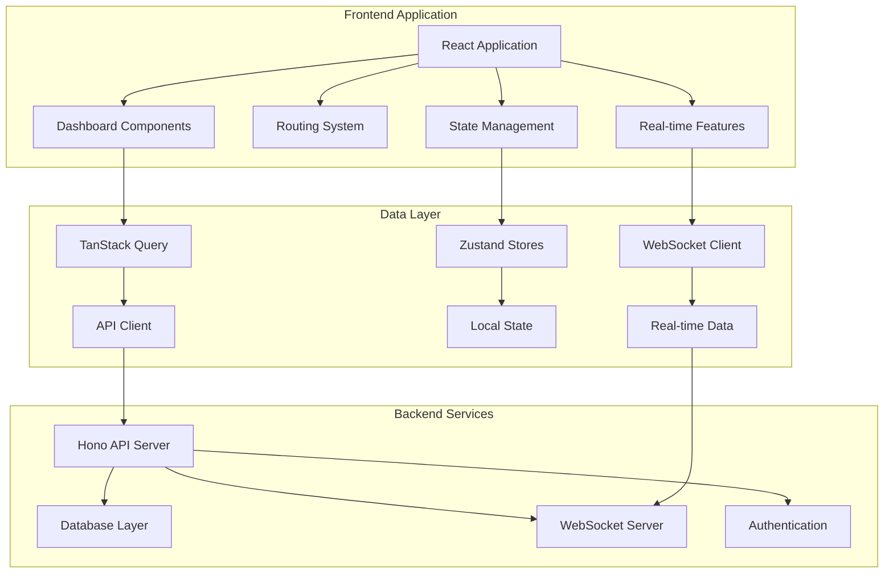

# Dashboard System Architecture

## Overview

The Meridian dashboard system is a modern, scalable, and accessible web application built with React, TypeScript, and a comprehensive set of supporting technologies. This document provides a detailed architectural overview of the dashboard system, its components, data flow, and design patterns.

## Table of Contents

1. [System Architecture](#system-architecture)
2. [Component Architecture](#component-architecture)
3. [Data Flow Architecture](#data-flow-architecture)
4. [Performance Architecture](#performance-architecture)
5. [Accessibility Architecture](#accessibility-architecture)
6. [Testing Architecture](#testing-architecture)
7. [Deployment Architecture](#deployment-architecture)
8. [Security Architecture](#security-architecture)

## System Architecture

### Technology Stack

```
Frontend Stack:
├── React 18                    # Core UI library with concurrent features
├── TypeScript                  # Type safety and developer experience
├── TanStack Router            # File-based routing with type safety
├── TanStack Query             # Server state management and caching
├── Zustand                    # Client-side global state management
├── Tailwind CSS               # Utility-first styling framework
├── Radix UI                   # Accessible primitive components
├── Framer Motion              # Animation and interactions
├── Vite                       # Build tool and development server
└── Vitest + Playwright        # Unit and E2E testing frameworks

Supporting Technologies:
├── Socket.IO Client           # Real-time WebSocket communication
├── React Hook Form + Zod      # Form handling and validation
├── Recharts                   # Data visualization library
├── Lucide React               # Icon library
├── date-fns                   # Date manipulation utilities
└── Web Audio API              # Accessibility audio features
```

### High-Level Architecture



### Module Structure

```
apps/web/src/
├── components/                 # Reusable UI components
│   ├── ui/                    # Base UI primitives
│   ├── dashboard/             # Dashboard-specific components
│   │   ├── sections/          # Refactored dashboard sections
│   │   ├── widgets/           # Dashboard widgets
│   │   └── charts/            # Data visualization components
│   ├── analytics/             # Analytics components
│   ├── auth/                  # Authentication components
│   ├── chat/                  # Communication components
│   └── shared/                # Shared utilities
├── hooks/                     # Custom React hooks
│   ├── queries/               # TanStack Query hooks
│   ├── mutations/             # Data mutation hooks
│   └── use-*.ts               # Feature-specific hooks
├── store/                     # Zustand state stores
├── routes/                    # File-based routing
│   └── dashboard/             # Dashboard route hierarchy
├── lib/                       # Utility libraries
├── constants/                 # Application constants
└── types/                     # TypeScript type definitions
```

## Component Architecture

### Dashboard Component Hierarchy

```
DashboardOverviewPage
├── LazyDashboardLayout (Performance wrapper)
├── ErrorBoundary (Error handling)
├── DashboardHeader (Navigation and actions)
├── DashboardStats (Key metrics widgets)
├── RiskAlertSection (Risk monitoring)
├── MilestoneSection (Project milestones)
├── RecentProjectsSection (Project overview)
├── NotificationSection (Real-time notifications)
├── SystemHealthSection (System status)
└── WorkspacePerformanceSection (Performance metrics)
```

### Component Design Patterns

#### 1. Compound Components Pattern

```typescript
// Dashboard sections use compound components for flexibility
export const DashboardSection = {
  Root: DashboardSectionRoot,
  Header: DashboardSectionHeader,
  Content: DashboardSectionContent,
  Actions: DashboardSectionActions
}

// Usage
<DashboardSection.Root>
  <DashboardSection.Header title="Analytics" />
  <DashboardSection.Content>
    <AnalyticsWidget />
  </DashboardSection.Content>
  <DashboardSection.Actions>
    <RefreshButton />
  </DashboardSection.Actions>
</DashboardSection.Root>
```

#### 2. Container-Presenter Pattern

```typescript
// Container handles data and logic
const DashboardStatsContainer = () => {
  const { data, isLoading, error } = useDashboardStats()
  const { permissions } = useRBACAuth()

  return (
    <DashboardStatsPresenter
      data={data}
      isLoading={isLoading}
      error={error}
      canViewStats={permissions.canView('dashboard_stats')}
    />
  )
}

// Presenter handles pure UI rendering
const DashboardStatsPresenter = ({ data, isLoading, error, canViewStats }) => {
  // Pure UI logic only
}
```

#### 3. Render Props Pattern for Flexibility

```typescript
// Flexible widget wrapper
const Widget = ({ children, title, onRefresh }) => (
  <div className="widget">
    <WidgetHeader title={title} onRefresh={onRefresh} />
    <WidgetContent>
      {typeof children === 'function' ? children({ refresh: onRefresh }) : children}
    </WidgetContent>
  </div>
)

// Usage with render props
<Widget title="Analytics" onRefresh={refreshAnalytics}>
  {({ refresh }) => <AnalyticsChart onDataUpdate={refresh} />}
</Widget>
```

### Widget Architecture

#### Widget Interface

```typescript
interface DashboardWidget {
  id: string
  type: WidgetType
  title: string
  config: WidgetConfig
  data?: WidgetData
  permissions: PermissionSet
  loading?: boolean
  error?: string
}

interface WidgetConfig {
  refreshInterval?: number
  size: 'small' | 'medium' | 'large'
  position: { x: number; y: number }
  filters?: FilterSet
  customization?: CustomizationOptions
}
```

#### Widget Lifecycle

```typescript
const useWidget = (config: WidgetConfig) => {
  const [data, setData] = useState(null)
  const [loading, setLoading] = useState(true)
  const [error, setError] = useState(null)

  // Data fetching with auto-refresh
  useEffect(() => {
    const fetchData = async () => {
      setLoading(true)
      try {
        const result = await widgetDataService.fetch(config)
        setData(result)
        setError(null)
      } catch (err) {
        setError(err.message)
      } finally {
        setLoading(false)
      }
    }

    fetchData()

    if (config.refreshInterval) {
      const interval = setInterval(fetchData, config.refreshInterval)
      return () => clearInterval(interval)
    }
  }, [config])

  return { data, loading, error, refresh: fetchData }
}
```

## Data Flow Architecture

### State Management Strategy

```typescript
// Global State (Zustand)
interface GlobalState {
  user: UserState
  workspace: WorkspaceState
  theme: ThemeState
  settings: SettingsState
}

// Server State (TanStack Query)
const useDashboardData = () => {
  return useQuery({
    queryKey: ['dashboard', workspaceId],
    queryFn: () => dashboardAPI.getData(workspaceId),
    staleTime: 5 * 60 * 1000, // 5 minutes
    refetchInterval: 30 * 1000, // 30 seconds
  })
}

// Local Component State (useState/useReducer)
const [filters, setFilters] = useState({
  dateRange: 'last_30_days',
  projects: [],
  users: []
})
```

### Data Flow Patterns

#### 1. Unidirectional Data Flow

```
API Server
    ↓ (HTTP/WebSocket)
TanStack Query Cache
    ↓ (React Query)
Dashboard Components
    ↓ (Props)
Widget Components
    ↓ (User Actions)
Event Handlers
    ↓ (API Calls)
API Server
```

#### 2. Real-time Data Flow

```typescript
// WebSocket integration for real-time updates
const useRealTimeUpdates = (workspaceId: string) => {
  const queryClient = useQueryClient()

  useEffect(() => {
    const socket = io(`/workspace/${workspaceId}`)

    socket.on('dashboard_update', (update) => {
      // Invalidate relevant queries to trigger refetch
      queryClient.invalidateQueries(['dashboard', workspaceId])
      queryClient.invalidateQueries(['analytics', update.type])
    })

    socket.on('notification', (notification) => {
      // Update notification store
      useNotificationStore.getState().addNotification(notification)
    })

    return () => socket.disconnect()
  }, [workspaceId])
}
```

### Caching Strategy

```typescript
// Multi-layer caching approach
const cachingStrategy = {
  // 1. Browser cache (HTTP headers)
  browserCache: {
    staticAssets: '1 year',
    apiResponses: '5 minutes'
  },

  // 2. TanStack Query cache
  queryCache: {
    dashboard: { staleTime: 5 * 60 * 1000 }, // 5 minutes
    analytics: { staleTime: 10 * 60 * 1000 }, // 10 minutes
    projects: { staleTime: 15 * 60 * 1000 } // 15 minutes
  },

  // 3. Component-level memoization
  componentCache: {
    expensiveCalculations: useMemo,
    stableCallbacks: useCallback,
    childComponents: memo
  }
}
```

## Performance Architecture

### Performance Optimization Strategies

#### 1. Code Splitting and Lazy Loading

```typescript
// Route-based code splitting
const AnalyticsPage = lazy(() => import('./routes/dashboard/analytics'))
const ProjectsPage = lazy(() => import('./routes/dashboard/projects'))

// Component-based lazy loading
const LazyDashboardLayout = lazy(() =>
  import('./components/performance/lazy-dashboard-layout')
)

// Widget-based dynamic imports
const loadWidget = async (widgetType: string) => {
  const { default: Widget } = await import(`./widgets/${widgetType}`)
  return Widget
}
```

#### 2. Virtualization for Large Datasets

```typescript
// Virtual scrolling for large task lists
import { FixedSizeList as List } from 'react-window'

const VirtualizedTaskList = ({ tasks }) => (
  <List
    height={600}
    itemCount={tasks.length}
    itemSize={60}
    itemData={tasks}
  >
    {TaskRow}
  </List>
)
```

#### 3. Memoization and Optimization

```typescript
// Expensive calculation memoization
const DashboardStats = memo(({ data }) => {
  const processedStats = useMemo(() => {
    return computeExpensiveStats(data)
  }, [data])

  return <StatsDisplay stats={processedStats} />
})

// Callback stabilization
const DashboardWidget = ({ onRefresh }) => {
  const handleRefresh = useCallback(() => {
    onRefresh()
  }, [onRefresh])

  return <Widget onRefresh={handleRefresh} />
}
```

#### 4. Bundle Optimization

```typescript
// Vite bundle configuration
export default defineConfig({
  build: {
    rollupOptions: {
      output: {
        manualChunks: {
          'dashboard-core': [
            './src/components/dashboard/index.ts',
            './src/routes/dashboard/index.tsx'
          ],
          'analytics': ['./src/components/analytics'],
          'charts': ['recharts', './src/components/charts'],
          'ui': ['@radix-ui/react-dialog', '@radix-ui/react-dropdown-menu']
        }
      }
    },
    chunkSizeWarningLimit: 1000
  }
})
```

### Performance Monitoring

```typescript
// Performance metrics collection
const usePerformanceMonitoring = () => {
  useEffect(() => {
    // Core Web Vitals monitoring
    getCLS(metric => console.log('CLS:', metric))
    getFID(metric => console.log('FID:', metric))
    getLCP(metric => console.log('LCP:', metric))

    // Custom performance marks
    performance.mark('dashboard-start')
    performance.mark('dashboard-end')
    performance.measure('dashboard-load', 'dashboard-start', 'dashboard-end')
  }, [])
}
```

## Accessibility Architecture

### Accessibility Strategy

#### 1. Semantic HTML Structure

```typescript
// Proper heading hierarchy and landmarks
const DashboardPage = () => (
  <main id="dashboard-container" role="main" aria-labelledby="dashboard-heading">
    <h1 id="dashboard-heading" className="sr-only">
      Dashboard Overview for {workspace.name}
    </h1>

    <nav role="navigation" aria-label="Dashboard navigation">
      <DashboardNavigation />
    </nav>

    <section role="region" aria-labelledby="stats-heading">
      <h2 id="stats-heading" className="sr-only">Dashboard Statistics</h2>
      <DashboardStats />
    </section>
  </main>
)
```

#### 2. Screen Reader Support

```typescript
// Custom hook for screen reader enhancements
const useScreenReaderSupport = (options: ChartAccessibilityOptions) => {
  const generateChartDescription = useCallback(() => {
    const summary = `${title}: ${chartType} showing ${dataPoints.length} data points`
    const details = dataPoints.map(point =>
      `${point.label}: ${point.value}${point.unit || ''}`
    ).join(', ')

    return `${summary}. ${details}`
  }, [title, chartType, dataPoints])

  const sonifyDataPoint = useCallback((dataPoint: ChartDataPoint) => {
    if (!enableSonification || !audioContext) return

    const oscillator = audioContext.createOscillator()
    const gainNode = audioContext.createGain()

    // Map data value to frequency
    const frequency = 200 + (dataPoint.value / maxValue) * 600
    oscillator.frequency.setValueAtTime(frequency, audioContext.currentTime)

    oscillator.connect(gainNode)
    gainNode.connect(audioContext.destination)

    oscillator.start()
    oscillator.stop(audioContext.currentTime + 0.2)
  }, [enableSonification, audioContext, maxValue])

  return {
    chartDescription: generateChartDescription(),
    sonifyDataPoint,
    exportToCSV: () => exportChartData(dataPoints),
    navigateData: (direction: 'next' | 'prev') => navigateDataPoints(direction)
  }
}
```

#### 3. Keyboard Navigation

```typescript
// Comprehensive keyboard navigation system
const useKeyboardNavigation = () => {
  useEffect(() => {
    const handleKeyDown = (event: KeyboardEvent) => {
      const { key, ctrlKey, shiftKey } = event

      // Dashboard-specific shortcuts
      if (ctrlKey) {
        switch (key) {
          case 'r':
            event.preventDefault()
            refreshDashboard()
            break
          case 'f':
            event.preventDefault()
            focusSearchInput()
            break
          case '1':
            event.preventDefault()
            navigateToSection('analytics')
            break
        }
      }

      // Focus management
      if (key === 'Tab') {
        manageFocusFlow(event)
      }
    }

    document.addEventListener('keydown', handleKeyDown)
    return () => document.removeEventListener('keydown', handleKeyDown)
  }, [])
}
```

#### 4. ARIA Live Regions

```typescript
// Real-time updates with screen reader announcements
const LiveRegionProvider = ({ children }) => (
  <div>
    {children}
    <div
      id="live-region"
      aria-live="polite"
      aria-atomic="true"
      className="sr-only"
    />
    <div
      id="alert-region"
      role="alert"
      aria-live="assertive"
      className="sr-only"
    />
  </div>
)

// Usage for announcements
const announceToScreenReader = (message: string, priority: 'polite' | 'assertive' = 'polite') => {
  const region = document.getElementById(priority === 'assertive' ? 'alert-region' : 'live-region')
  if (region) {
    region.textContent = message
    setTimeout(() => region.textContent = '', 1000)
  }
}
```

## Testing Architecture

### Testing Strategy Pyramid

```
                    E2E Tests (Playwright)
                ├── Critical user journeys
                ├── Cross-browser compatibility
                ├── Accessibility compliance
                └── Performance validation

            Integration Tests (Vitest + RTL)
        ├── Component integration
        ├── API integration
        ├── WebSocket integration
        └── Store integration

    Unit Tests (Vitest + RTL)
├── Component logic
├── Custom hooks
├── Utilities
└── Business logic
```

### Test Organization

```
src/
├── __tests__/
│   ├── integration/           # Integration tests
│   │   ├── websocket.test.ts
│   │   ├── dashboard.test.tsx
│   │   └── analytics.test.tsx
│   └── setup/                 # Test configuration
├── components/
│   └── dashboard/
│       └── __tests__/         # Component unit tests
└── hooks/
    └── __tests__/             # Hook unit tests

tests/
└── e2e/                       # End-to-end tests
    ├── dashboard.spec.ts
    ├── dashboard-critical-flows.spec.ts
    ├── dashboard-widget-interactions.spec.ts
    └── dashboard-advanced-features.spec.ts
```

### Testing Patterns

#### 1. Component Testing

```typescript
// Dashboard component testing with proper setup
describe('DashboardStats', () => {
  const renderWithProviders = (props = {}) => {
    return render(
      <QueryClientProvider client={queryClient}>
        <WorkspaceProvider>
          <DashboardStats {...props} />
        </WorkspaceProvider>
      </QueryClientProvider>
    )
  }

  test('should display stats with correct accessibility attributes', async () => {
    renderWithProviders()

    expect(screen.getByRole('region', { name: /dashboard statistics/i }))
      .toBeInTheDocument()
    expect(screen.getByLabelText(/total tasks/i)).toBeInTheDocument()
  })
})
```

#### 2. Integration Testing

```typescript
// WebSocket integration testing
describe('Real-time Dashboard Updates', () => {
  test('should update dashboard when receiving WebSocket data', async () => {
    const { result } = renderHook(() => useRealTimeUpdates('workspace-1'))

    // Simulate WebSocket message
    act(() => {
      mockSocket.emit('dashboard_update', {
        type: 'task_completed',
        data: { taskId: '123', status: 'completed' }
      })
    })

    await waitFor(() => {
      expect(queryClient.getQueryData(['dashboard', 'workspace-1']))
        .toHaveBeenInvalidated()
    })
  })
})
```

#### 3. E2E Testing

```typescript
// Critical dashboard user flow testing
test('should complete analytics workflow', async ({ page }) => {
  await page.goto('/dashboard')
  await page.click('[data-testid="nav-analytics"]')

  await expect(page).toHaveURL(/analytics/)

  // Test chart interaction
  await page.hover('.recharts-bar-rectangle')
  await expect(page.locator('[role="tooltip"]')).toBeVisible()

  // Test data export
  await page.click('[data-testid="export-chart"]')
  await expect(page.locator('[data-testid="export-options"]')).toBeVisible()
})
```

## Deployment Architecture

### Build and Deployment Pipeline

```yaml
# CI/CD Pipeline Overview
stages:
  - build:
      - Install dependencies (pnpm install)
      - Type checking (tsc --noEmit)
      - Linting (eslint --fix)
      - Unit tests (vitest run)
      - Build application (vite build)

  - test:
      - Integration tests (vitest run --config vitest.integration.config.ts)
      - E2E tests (playwright test)
      - Accessibility tests (axe-core)
      - Performance tests (lighthouse)

  - deploy:
      - Build optimization
      - Asset optimization
      - CDN deployment
      - Health checks
```

### Environment Configuration

```typescript
// Environment-specific configuration
interface EnvironmentConfig {
  apiUrl: string
  wsUrl: string
  features: FeatureFlags
  analytics: AnalyticsConfig
  performance: PerformanceConfig
}

const config: Record<string, EnvironmentConfig> = {
  development: {
    apiUrl: 'http://localhost:3005',
    wsUrl: 'ws://localhost:3006',
    features: { enableDebug: true, enableMockData: true },
    analytics: { enableTracking: false },
    performance: { enableProfiling: true }
  },
  production: {
    apiUrl: 'https://api.meridian.com',
    wsUrl: 'wss://api.meridian.com',
    features: { enableDebug: false, enableMockData: false },
    analytics: { enableTracking: true },
    performance: { enableProfiling: false }
  }
}
```

## Security Architecture

### Security Measures

#### 1. Authentication and Authorization

```typescript
// RBAC-based security
interface SecurityContext {
  user: AuthenticatedUser
  permissions: PermissionSet
  session: SessionData
}

const useSecurityContext = () => {
  const { user, session } = useAuthStore()
  const { permissions } = useRBACAuth(user.role)

  return {
    user,
    permissions,
    session,
    canAccess: (resource: string, action: string) =>
      permissions.has(`${resource}:${action}`),
    isAuthenticated: !!session?.valid
  }
}
```

#### 2. Data Protection

```typescript
// Sensitive data handling
const sanitizeUserData = (userData: UserData) => {
  const { password, apiKeys, ...safeData } = userData
  return safeData
}

// XSS protection
const sanitizeInput = (input: string) => {
  return DOMPurify.sanitize(input)
}
```

#### 3. Security Monitoring

```typescript
// Security event logging
const useSecurityMonitoring = () => {
  const logSecurityEvent = useCallback((event: SecurityEvent) => {
    console.log('[SECURITY]', {
      type: event.type,
      timestamp: new Date().toISOString(),
      userId: event.userId,
      details: event.details
    })
  }, [])

  return { logSecurityEvent }
}
```

## Conclusion

The Meridian dashboard system represents a modern, scalable, and accessible web application architecture. Key architectural decisions include:

1. **Component-Based Architecture**: Modular, reusable components with clear separation of concerns
2. **Performance-First Design**: Code splitting, lazy loading, and comprehensive optimization strategies
3. **Accessibility by Design**: Screen reader support, keyboard navigation, and WCAG compliance
4. **Comprehensive Testing**: Multi-layer testing strategy ensuring reliability and quality
5. **Real-time Capabilities**: WebSocket integration for live data updates and collaboration
6. **Security-Conscious**: RBAC, data protection, and security monitoring throughout

This architecture supports the current requirements while providing flexibility for future enhancements and scaling needs.

---

**Document Version**: 1.0
**Last Updated**: 2025-01-15
**Maintained By**: Development Team