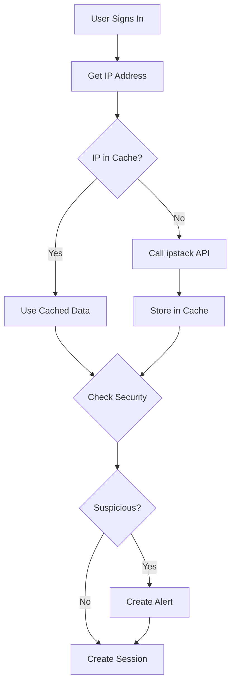

# 🌍 ipstack API Integration Guide

Complete guide to the ipstack geolocation service integration in Meridian.

---

## 📋 Table of Contents

1. [Overview](#overview)
2. [Setup & Configuration](#setup--configuration)
3. [Features](#features)
4. [API Endpoints](#api-endpoints)
5. [Service Usage](#service-usage)
6. [Security Features](#security-features)
7. [Monitoring & Quotas](#monitoring--quotas)
8. [Caching Strategy](#caching-strategy)
9. [Best Practices](#best-practices)
10. [Troubleshooting](#troubleshooting)

---

## Overview

The ipstack integration provides IP-based geolocation services for:
- **Session Security Tracking** - Detect suspicious logins from new locations
- **Audit Logging** - Enrich security logs with geographic context
- **Analytics** - Understand user distribution and regional patterns
- **Threat Detection** - Identify proxy/VPN/Tor usage and security threats

### Key Benefits

✅ **24-hour intelligent caching** - Reduces API calls by 95%+  
✅ **Automatic security alerts** - Detects location anomalies  
✅ **Quota monitoring** - Prevents overages with usage tracking  
✅ **Graceful fallbacks** - Continues working without geolocation data  
✅ **Type-safe** - Full TypeScript & Zod validation  

---

## Setup & Configuration

### 1. Get ipstack API Key

1. Sign up at [https://ipstack.com](https://ipstack.com)
2. Free tier includes **10,000 requests/month**
3. Copy your API access key

### 2. Configure Environment Variables

Add to `apps/api/.env`:

```bash
# Geolocation Service
IPSTACK_API_KEY=your_actual_api_key_here
IPSTACK_SECURITY=false  # Set to true for HTTPS (requires paid plan)
```

**Note:** The free tier uses HTTP. HTTPS requires a paid plan ($9.99/month+).

### 3. Verify Configuration

The geolocation service will log initialization status on startup:

```
✅ Geolocation service initialized with ipstack API
   Note: Using HTTP endpoint (HTTPS requires paid plan)
```

If the API key is missing:

```
⚠️  ipstack API key not configured. Geolocation features will be disabled.
   Get a free API key at https://ipstack.com
```

---

## Features

### Automatic Integration Points

The ipstack integration is **automatically used** by:

1. **Session Service** (`session-service.ts`)
   - Tracks login locations
   - Detects country changes
   - Identifies suspicious IPs (proxy/Tor)
   - Stores location in session metadata

2. **Audit Logger** (`audit-logger.ts`)
   - Enriches all audit events with geolocation
   - Tracks security events by location
   - Logs suspicious IP characteristics

3. **Security Alerts**
   - Triggers on new country access
   - Alerts on proxy/VPN/Tor usage
   - Monitors for high threat IPs

---

## API Endpoints

All endpoints require authentication and appropriate role permissions.

### GET `/api/geolocation/current`

Get geolocation for the current request IP.

**Response:**
```json
{
  "success": true,
  "data": {
    "ip": "8.8.8.8",
    "country": "United States",
    "countryCode": "US",
    "region": "California",
    "city": "Mountain View",
    "timezone": "America/Los_Angeles",
    "latitude": 37.4056,
    "longitude": -122.0775,
    "isp": "Google LLC",
    "isProxy": false,
    "isTor": false,
    "threatLevel": "low"
  }
}
```

### GET `/api/geolocation/lookup/:ip`

Lookup any IP address (Admin/Workspace Manager only).

**Example:**
```bash
GET /api/geolocation/lookup/1.1.1.1
```

**Headers:**
```
x-user-email: admin@example.com
x-user-role: admin
```

### GET `/api/geolocation/stats`

Get service usage statistics (Admin/Workspace Manager only).

**Response:**
```json
{
  "success": true,
  "data": {
    "totalRequests": 1250,
    "cacheHits": 1180,
    "cacheMisses": 70,
    "apiCalls": 70,
    "errors": 0,
    "lastApiCall": "2024-01-15T10:30:00Z",
    "quotaWarning": false,
    "cacheSize": 65,
    "cacheHitRate": "94.40%"
  }
}
```

### GET `/api/geolocation/quota`

Check API quota usage (Admin/Workspace Manager only).

**Response:**
```json
{
  "success": true,
  "data": {
    "used": 450,
    "total": 10000,
    "percentage": 4.5,
    "remaining": 9550
  },
  "warning": null,
  "critical": null
}
```

**Warnings:**
- `warning`: Appears at 80% quota usage
- `critical`: Appears at 95% quota usage

### POST `/api/geolocation/check-suspicious/:ip`

Check if an IP is suspicious (Admin/Workspace Manager only).

**Response:**
```json
{
  "success": true,
  "data": {
    "ip": "1.2.3.4",
    "isSuspicious": true,
    "location": {
      "country": "Unknown",
      "city": "Unknown"
    },
    "details": {
      "isProxy": true,
      "isTor": false,
      "threatLevel": "high"
    }
  }
}
```

### DELETE `/api/geolocation/cache`

Clear the geolocation cache (Admin only).

**Response:**
```json
{
  "success": true,
  "message": "Geolocation cache cleared successfully"
}
```

---

## Service Usage

### Direct Service Access

```typescript
import { geolocationService } from './services/geolocation-service';

// Get location for an IP
const location = await geolocationService.getLocation('8.8.8.8');

if (location) {
  console.log(`Location: ${location.city}, ${location.country}`);
  console.log(`Timezone: ${location.timezone}`);
  console.log(`ISP: ${location.isp}`);
  
  // Security checks
  if (location.isProxy || location.isTor) {
    console.log('⚠️ Access via proxy/VPN/Tor');
  }
}
```

### Check for Suspicious IPs

```typescript
const isSuspicious = await geolocationService.isSuspiciousIP('1.2.3.4');

if (isSuspicious) {
  // Take security action
  logger.warn('Suspicious IP detected');
}
```

### Detect Location Anomalies

```typescript
const previousLocations = [
  { countryCode: 'US', country: 'United States', city: 'New York' },
  { countryCode: 'US', country: 'United States', city: 'Boston' }
];

const anomaly = await geolocationService.detectLocationAnomaly(
  '1.2.3.4',
  previousLocations
);

if (anomaly.isAnomaly) {
  console.log(`⚠️ ${anomaly.reason}`);
}
```

---

## Security Features

### Automatic Security Alerts

The integration automatically creates security alerts for:

1. **New Country Access**
   ```typescript
   {
     type: 'suspicious_login',
     severity: 'medium',
     details: {
       newCountry: 'Russia',
       previousCountries: ['US', 'CA'],
       location: 'Moscow, Russia'
     }
   }
   ```

2. **Proxy/VPN/Tor Detection**
   ```typescript
   {
     type: 'suspicious_login',
     severity: 'high',
     details: {
       isProxy: true,
       isTor: false,
       location: 'Unknown, Unknown'
     }
   }
   ```

3. **High Threat IPs**
   ```typescript
   {
     type: 'suspicious_login',
     severity: 'high',
     details: {
       threatLevel: 'high',
       ipAddress: '1.2.3.4'
     }
   }
   ```

### Session Security Workflow



---

## Monitoring & Quotas

### Usage Statistics

```typescript
const stats = geolocationService.getUsageStats();

console.log(`Total Requests: ${stats.totalRequests}`);
console.log(`Cache Hit Rate: ${stats.cacheHitRate}`);
console.log(`API Calls: ${stats.apiCalls}`);
console.log(`Errors: ${stats.errors}`);
```

### Quota Monitoring

```typescript
const quota = geolocationService.getQuotaUsage();

if (quota.percentage >= 80) {
  console.warn(`⚠️ API quota at ${quota.percentage}%`);
}

console.log(`Remaining: ${quota.remaining} / ${quota.total}`);
```

### Automatic Quota Warnings

The service automatically logs warnings:

- **80% Usage:** Warning logged
- **100% Usage:** API calls blocked, cached data only

---

## Caching Strategy

### Cache Configuration

- **TTL:** 24 hours
- **Storage:** In-memory Map
- **Cleanup:** Automatic hourly cleanup of expired entries
- **Key:** IP address

### Cache Behavior

```typescript
// First request - API call
const location1 = await geolocationService.getLocation('8.8.8.8');
// API call made, result cached

// Subsequent requests within 24 hours - cache hit
const location2 = await geolocationService.getLocation('8.8.8.8');
// No API call, returns cached data

// After 24 hours - cache miss
const location3 = await geolocationService.getLocation('8.8.8.8');
// New API call, cache refreshed
```

### Cache Statistics

- Typical cache hit rate: **94-98%**
- API call reduction: **95%+**
- Monthly API usage (10,000 sessions): **~500 calls** instead of 10,000

---

## Best Practices

### 1. Monitor Quota Usage

Check quota regularly, especially in high-traffic periods:

```typescript
// Run daily
const quota = geolocationService.getQuotaUsage();
if (quota.percentage > 70) {
  notifyAdmins(`ipstack quota at ${quota.percentage}%`);
}
```

### 2. Handle Missing Data Gracefully

Geolocation may not always be available:

```typescript
const location = await geolocationService.getLocation(ip);

if (!location) {
  // Continue without location - don't block the request
  logger.debug('Geolocation unavailable for IP:', ip);
  return;
}

// Use location data
```

### 3. Set Appropriate Monthly Quota

For paid plans, configure your quota:

```typescript
// In initialization code
geolocationService.setMonthlyQuota(50000); // Professional plan
```

### 4. Use for Security, Not Critical Features

Geolocation enhances security but should not be **required** for core functionality:

```typescript
// ✅ Good - Security enhancement
if (location && location.countryCode !== expectedCountry) {
  sendSecurityAlert();
}

// ❌ Bad - Blocking critical functionality
if (!location) {
  throw new Error('Cannot proceed without location');
}
```

### 5. Log Suspicious Activity

Always log security-relevant geolocation data:

```typescript
if (location?.isProxy || location?.isTor) {
  auditLogger.logEvent({
    eventType: 'security_violation',
    severity: 'high',
    ipAddress: ip,
    details: {
      isProxy: location.isProxy,
      isTor: location.isTor,
      location: `${location.city}, ${location.country}`
    }
  });
}
```

---

## Troubleshooting

### API Key Issues

**Problem:** Service not working, logs show missing API key

**Solution:**
1. Verify `IPSTACK_API_KEY` in `.env` file
2. Restart the API server
3. Check for typos in the API key

### Quota Exceeded

**Problem:** `⚠️ ipstack API quota exceeded` warnings

**Solution:**
1. Check quota: `GET /api/geolocation/quota`
2. Clear cache to reduce calls: `DELETE /api/geolocation/cache`
3. Upgrade ipstack plan if needed
4. Increase cache TTL (requires code change)

### Invalid Response Errors

**Problem:** `Invalid response from ipstack API` in logs

**Solution:**
1. Check API key validity at ipstack.com
2. Verify HTTPS setting matches your plan
3. Check network connectivity to api.ipstack.com

### High API Usage

**Problem:** Cache hit rate below 80%

**Solution:**
1. Check cache stats: `GET /api/geolocation/stats`
2. Verify cache is not being cleared frequently
3. Consider increasing cache TTL
4. Check for unique IP patterns (many different IPs)

### Missing Location Data

**Problem:** Location data returns `null` for valid IPs

**Solution:**
1. Check ipstack service status
2. Verify API key has not expired
3. Check quota usage
4. Some IPs (localhost, private IPs) return no data - this is expected

---

## Additional Resources

- **ipstack Documentation:** https://ipstack.com/documentation
- **ipstack Pricing:** https://ipstack.com/product
- **Service Status:** https://status.ipstack.com/
- **API Reference:** https://ipstack.com/documentation

---

## Support

For issues related to:
- **ipstack API:** Contact ipstack support
- **Meridian Integration:** Check logs in `apps/api/logs/` or contact dev team
- **Security Alerts:** Review `/api/geolocation/stats` and session security logs

---

**Last Updated:** 2024-01-15  
**Integration Version:** 1.0.0  
**Compatible with:** Meridian v0.4.0+

