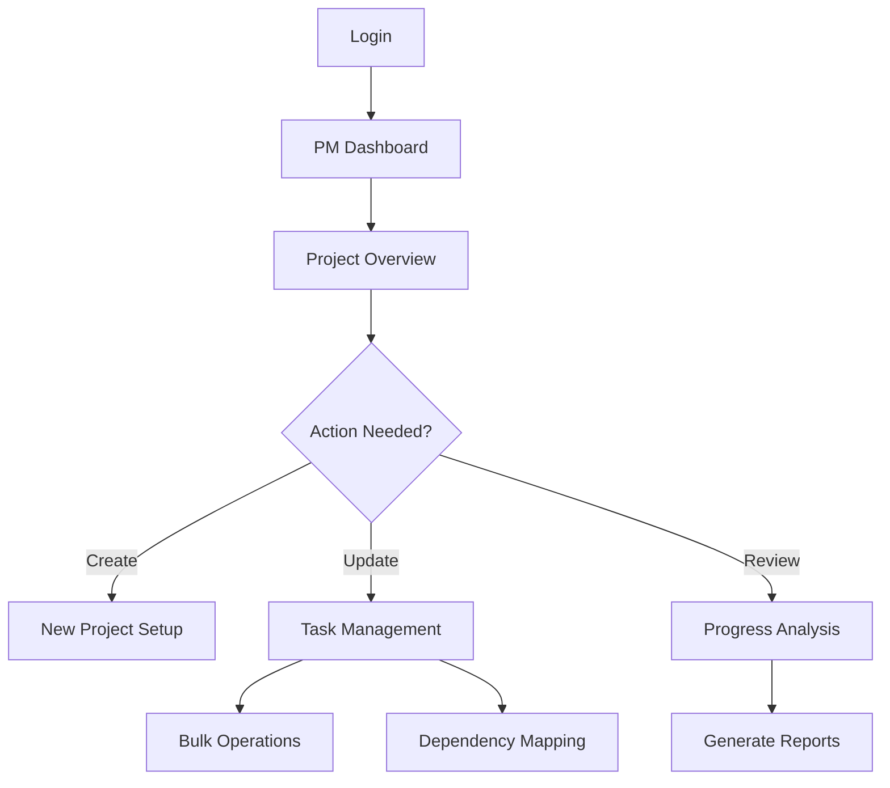
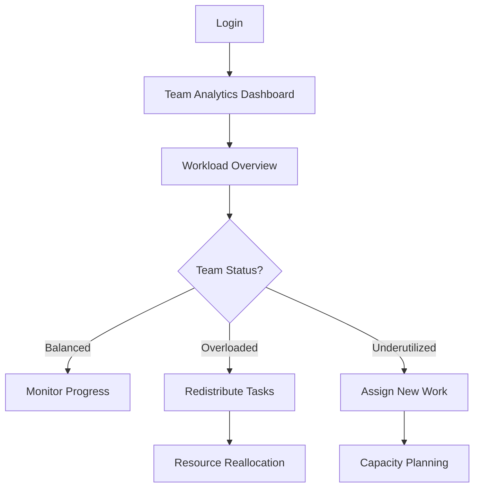
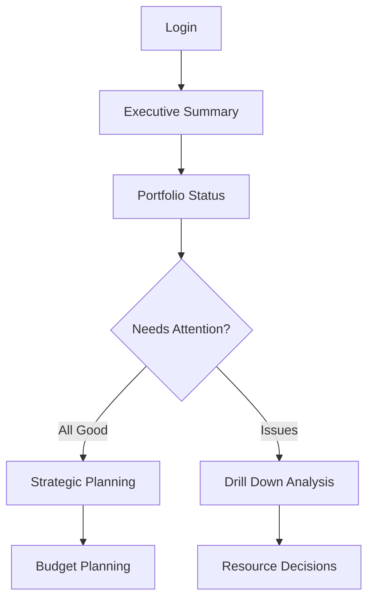

# Information Architecture: Meridian Kanban Dashboard

**Status**: In Progress  
**Phase**: Phase 3 - Information Architecture  
**Date**: January 2025  

## 🎯 Overview
This document outlines the information architecture for Meridian, a persona-driven kanban dashboard designed to serve the specific needs of project managers, team leads, executives, developers, and designers.

## 📊 Site Map & Navigation Structure

### Primary Navigation
```
Meridian Dashboard
├── 📋 Projects
│   ├── Active Projects
│   ├── Archived Projects
│   └── Project Templates
├── 📊 Analytics
│   ├── Time Tracking
│   ├── Performance Metrics
│   └── Resource Utilization
├── 👥 Team
│   ├── Team Members
│   ├── Workload Distribution
│   └── Capacity Planning
├── 📁 Files
│   ├── Recent Files
│   ├── Shared Assets
│   └── Version History
└── ⚙️ Settings
    ├── Profile
    ├── Notifications
    └── Integrations
```

### Secondary Navigation (Context-Aware)
Based on user persona and current view:

**Sarah (PM) - Quick Actions**
- Create New Project
- Bulk Task Assignment
- Dependency Mapping
- Progress Reports

**David (Team Lead) - Analytics Focus**
- Team Performance Dashboard
- Resource Allocation
- Time Reports
- Workload Balance

**Jennifer (Executive) - Strategic View**
- Portfolio Overview
- High-level Metrics
- Project Status Summary
- Resource Planning

**Mike (Developer) - Task Management**
- My Tasks
- Time Tracking
- Code Repository Links
- Development Workflow

**Lisa (Designer) - Asset Management**
- Design Files
- Asset Library
- Review & Approval
- Version Control

## 🗂️ Information Hierarchy

### Level 1: Dashboard Views
```
┌─ Executive Dashboard (Jennifer)
├─ Project Management Hub (Sarah)
├─ Team Analytics Center (David)
├─ Developer Workspace (Mike)
└─ Design Studio (Lisa)
```

### Level 2: Feature Modules
```
Project Kanban Board
├── Column Management
├── Task Cards
├── Subtask Breakdown
├── Dependency Visualization
├── Time Tracking
├── File Attachments
├── Team Collaboration
└── Progress Indicators
```

### Level 3: Content Types

#### Task Card Structure
```yaml
Task Card:
  - Basic Info:
    - Title
    - Description
    - Priority Level
    - Status
    - Assignee(s)
  - Time Tracking:
    - Estimated Hours
    - Actual Hours
    - Start/End Dates
    - Time Logs
  - Dependencies:
    - Blocked By
    - Blocking
    - Related Tasks
  - Collaboration:
    - Comments/Notes
    - Mentions
    - Activity Log
  - Assets:
    - File Attachments
    - Design Assets
    - Links/References
```

## 🔄 User Flows by Persona

### Sarah (Project Manager) Flow


### David (Team Lead) Flow


### Jennifer (Executive) Flow


## 📱 Component Architecture

### Layout Components (Using Magic UI)
- **Dock Navigation**: Primary navigation bar with Mac-style animations
- **Bento Grid**: Dashboard widget layout for different persona views
- **Animated List**: Real-time activity feeds and notifications
- **Globe Component**: Global team collaboration indicators

### Interactive Elements
- **Orbiting Circles**: Dependency visualization around tasks
- **Progress Bars**: Animated circular progress for project completion
- **Icon Cloud**: Technology stack and tool integration display
- **Marquee**: Scrolling announcements and updates

### Data Visualization
- **Avatar Circles**: Team member assignment indicators
- **File Tree**: Project structure and asset organization
- **Code Comparison**: Before/after task states
- **Terminal**: Command center for power users

## 📋 Content Strategy

### Content Prioritization Matrix
```
High Priority / High Frequency:
- Task status updates
- Time tracking
- Team assignments
- Progress indicators

High Priority / Low Frequency:
- Project creation
- Team restructuring
- Major deadline changes
- System configurations

Low Priority / High Frequency:
- Activity notifications
- Minor task updates
- Comments/mentions
- File uploads

Low Priority / Low Frequency:
- Archive operations
- Historical reports
- System maintenance
- User onboarding
```

### Persona-Specific Content Needs

#### Sarah (PM) Content Requirements
- **Primary**: Project status, task assignments, timeline adherence
- **Secondary**: Team capacity, resource allocation, risk indicators
- **Tertiary**: Historical performance, predictive analytics

#### David (Team Lead) Content Requirements
- **Primary**: Team workload, individual performance, bottlenecks
- **Secondary**: Skill development, capacity planning, efficiency metrics
- **Tertiary**: Long-term team growth, succession planning

#### Jennifer (Executive) Content Requirements
- **Primary**: Portfolio health, budget utilization, strategic alignment
- **Secondary**: Resource requirements, competitive positioning
- **Tertiary**: Market trends, technology adoption

## 🔧 Integration Points

### External System Connections
```yaml
Development Tools:
  - GitHub/GitLab
  - Jira/Linear
  - CI/CD Pipelines
  - Code Review Tools

Design Tools:
  - Figma
  - Adobe Creative Suite
  - Sketch
  - InVision

Communication:
  - Slack
  - Microsoft Teams
  - Discord
  - Email Systems

Business Tools:
  - Google Workspace
  - Microsoft 365
  - Notion
  - Confluence
```

### API Strategy
- **GraphQL**: Real-time data updates
- **WebSocket**: Live collaboration features
- **REST APIs**: External integrations
- **Webhooks**: Event-driven notifications

## 📊 Data Model Structure

### Core Entities
```yaml
Project:
  - id, name, description
  - status, priority, timeline
  - team_members, stakeholders
  - metrics, budget

Task:
  - id, title, description
  - status, priority, labels
  - assignee, dependencies
  - time_tracking, files

User:
  - id, name, email, role
  - permissions, preferences
  - teams, projects
  - activity_log

Team:
  - id, name, description
  - members, capacity
  - projects, metrics
  - performance_data
```

## 🎨 Visual Information Hierarchy

### Color-Coded System
```yaml
Priority Levels:
  Critical: #FF4444 (Red)
  High: #FF8800 (Orange)
  Medium: #FFCC00 (Yellow)
  Low: #44AA44 (Green)

Status Indicators:
  Blocked: #CC0000 (Dark Red)
  In Progress: #0066CC (Blue)
  Review: #8800CC (Purple)
  Done: #00AA00 (Green)

Persona Themes:
  Sarah (PM): #3B82F6 (Blue)
  David (Team): #10B981 (Emerald)
  Jennifer (Exec): #8B5CF6 (Purple)
  Mike (Dev): #F59E0B (Amber)
  Lisa (Design): #EC4899 (Pink)
```

## 🔍 Search & Filter Strategy

### Global Search Capabilities
- **Universal Search**: Tasks, projects, files, people
- **Scoped Search**: Within projects, teams, or time periods
- **Smart Filters**: Auto-suggestions based on user behavior
- **Saved Searches**: Personalized quick access

### Filter Categories
```yaml
By Status:
  - Active/Inactive
  - Priority Level
  - Completion State
  - Assignee Status

By Time:
  - Due Date Range
  - Creation Date
  - Last Modified
  - Time Spent

By Team:
  - Department
  - Role
  - Skill Set
  - Availability

By Project:
  - Category
  - Client
  - Budget Range
  - Timeline
```

## 📈 Analytics & Reporting Structure

### Dashboard Metrics by Persona
```yaml
Sarah (PM) Metrics:
  - Project completion rates
  - Timeline adherence
  - Resource utilization
  - Risk indicators

David (Team Lead) Metrics:
  - Team productivity
  - Individual performance
  - Workload distribution
  - Skill development

Jennifer (Executive) Metrics:
  - Portfolio ROI
  - Strategic alignment
  - Market positioning
  - Resource efficiency
```

## 🚀 Next Steps

1. **Wireframe Creation**: Begin low-fidelity wireframes based on this IA
2. **User Flow Validation**: Test information flows with persona scenarios
3. **Component Selection**: Choose specific Magic UI components for each section
4. **Data Architecture**: Finalize database schema and API endpoints
5. **Prototype Development**: Create interactive prototypes for user testing

---

**Epic Alignment**:
- **Epic 1.1**: ✅ Subtask hierarchy and dependencies mapped
- **Epic 1.2**: ✅ Gantt view structure planned
- **Epic 2.1**: ✅ File management architecture defined
- **Epic 3.1**: ✅ Time tracking integration points identified
- **Epic 4.1**: ✅ Real-time collaboration framework established

**Magic UI Integration**: ✅ Components mapped to specific features and use cases 