# User Flow Diagrams: Meridian Dashboard

**Status**: In Progress  
**Phase**: Phase 4 - Wireframing & Prototyping  
**Date**: January 2025  

## 🎯 Flow Overview

This document presents detailed user flow diagrams for each persona, mapping their specific workflows and interactions with the Meridian kanban dashboard. Each flow demonstrates how users accomplish their primary goals efficiently.

## 👩‍💼 Sarah (Project Manager) Flows

### Flow 1: Project Creation & Setup
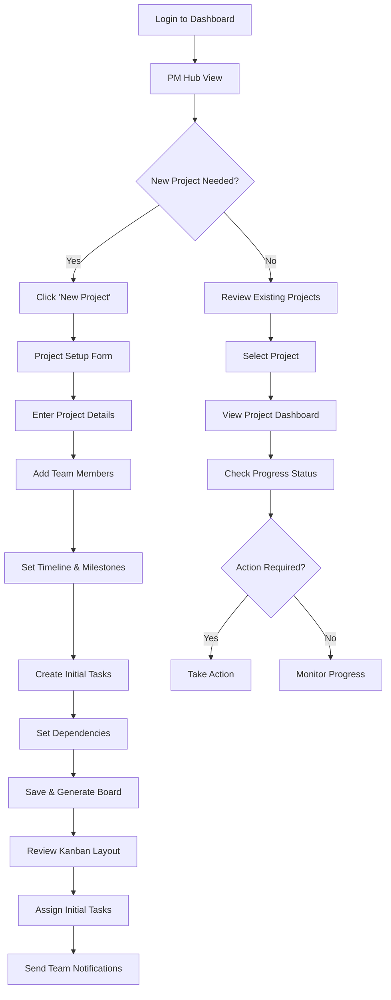

### Flow 2: Daily Project Management
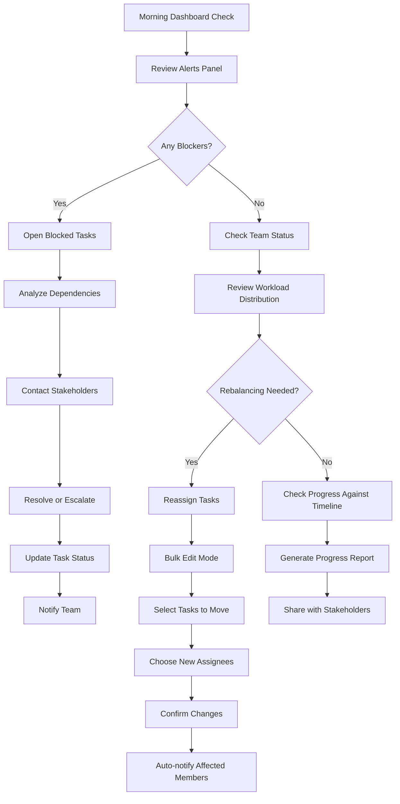

### Flow 3: Risk Management & Escalation
```mermaid
graph TD
    A[Identify Risk Indicator] --> B[Click Risk Alert]
    B --> C[View Risk Details]
    C --> D{Risk Level?}
    D -->|Low| E[Add to Watch List]
    D -->|Medium| F[Create Mitigation Task]
    D -->|High| G[Immediate Escalation]
    
    F --> H[Define Mitigation Steps]
    H --> I[Assign to Team Member]
    I --> J[Set Priority & Deadline]
    J --> K[Monitor Progress]
    
    G --> L[Notify Jennifer (Executive)]
    L --> M[Prepare Risk Assessment]
    M --> N[Schedule Emergency Meeting]
    N --> O[Document Action Plan]
```

## 👨‍💼 David (Team Lead) Flows

### Flow 1: Team Capacity Planning
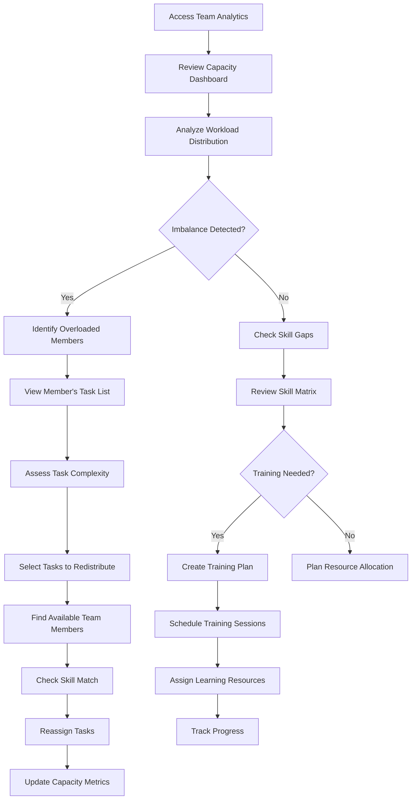

### Flow 2: Performance Optimization
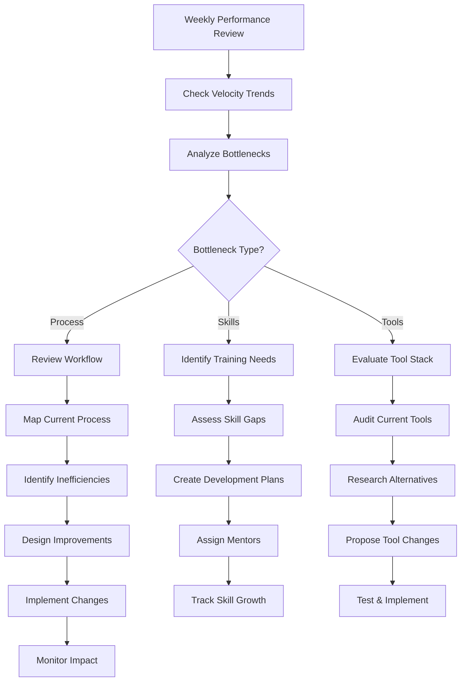

### Flow 3: Team Member Support
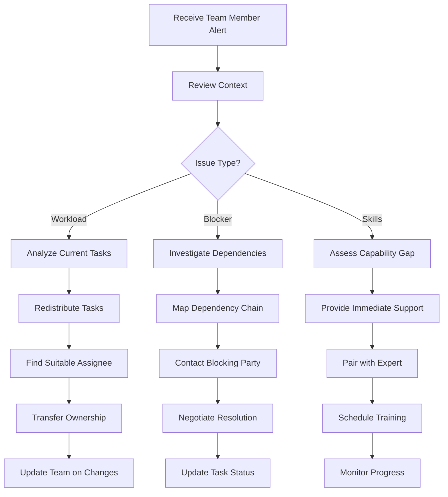

## 👩‍💼 Jennifer (Executive) Flows

### Flow 1: Strategic Portfolio Review
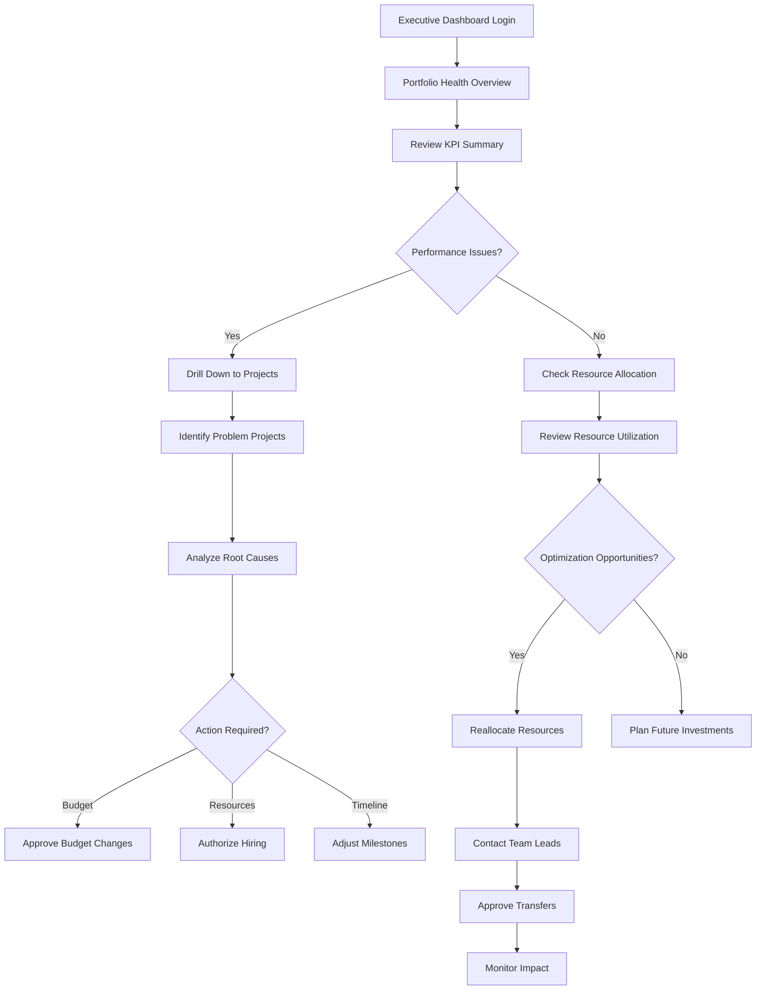

### Flow 2: Strategic Decision Making
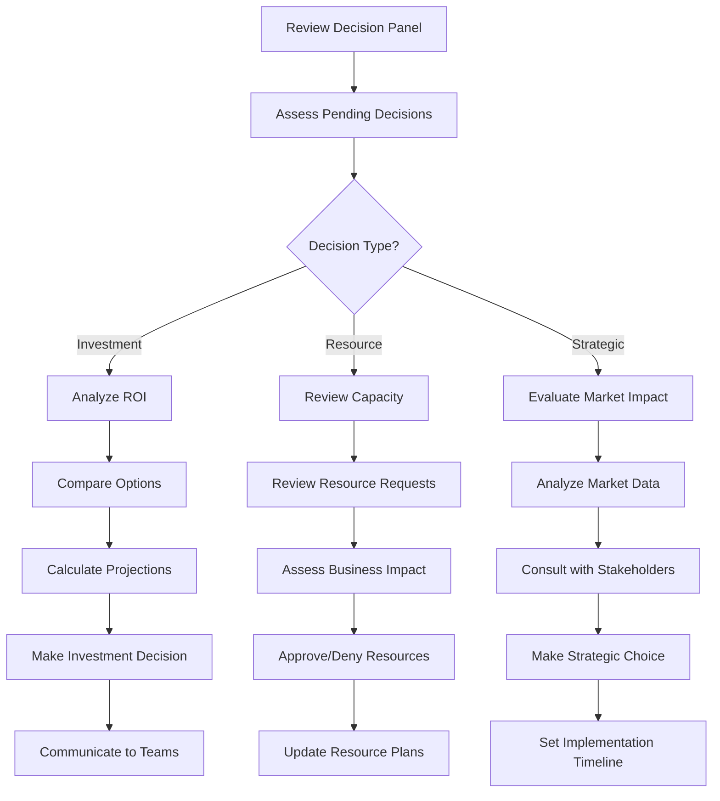

### Flow 3: Risk Assessment & Mitigation
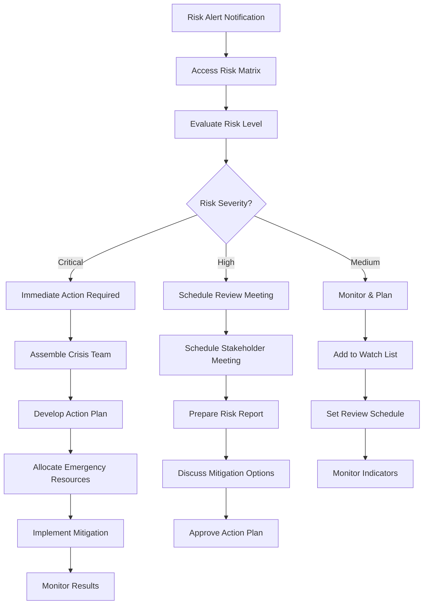

## 👨‍💻 Mike (Developer) Flows

### Flow 1: Daily Task Management
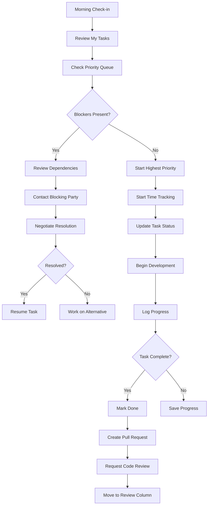

### Flow 2: Code Review & Collaboration
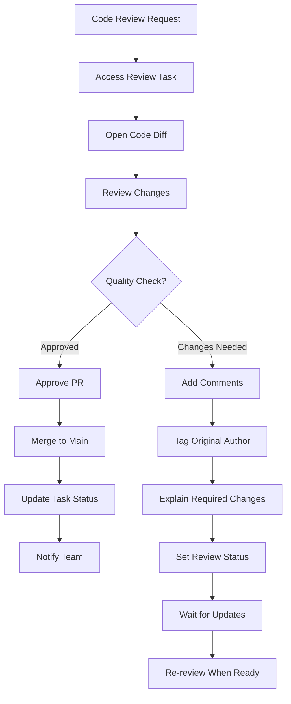

### Flow 3: Sprint Planning & Estimation
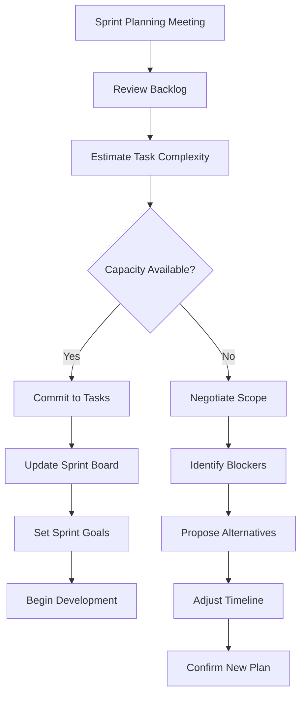

## 🎨 Lisa (Designer) Flows

### Flow 1: Design Asset Creation
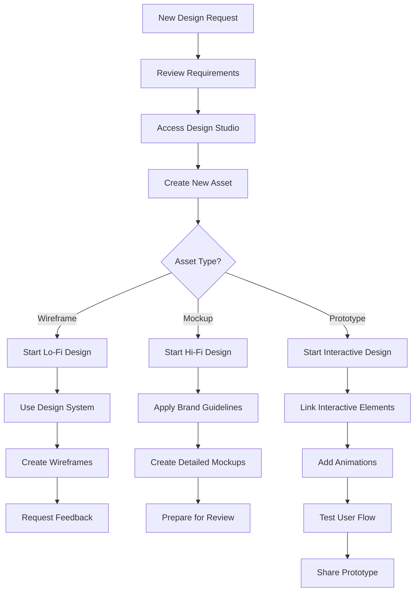

### Flow 2: Design Review Process
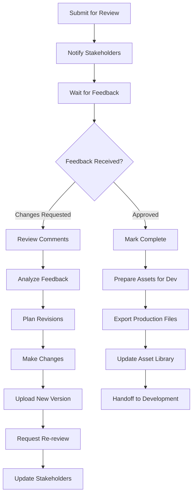

### Flow 3: Design System Maintenance
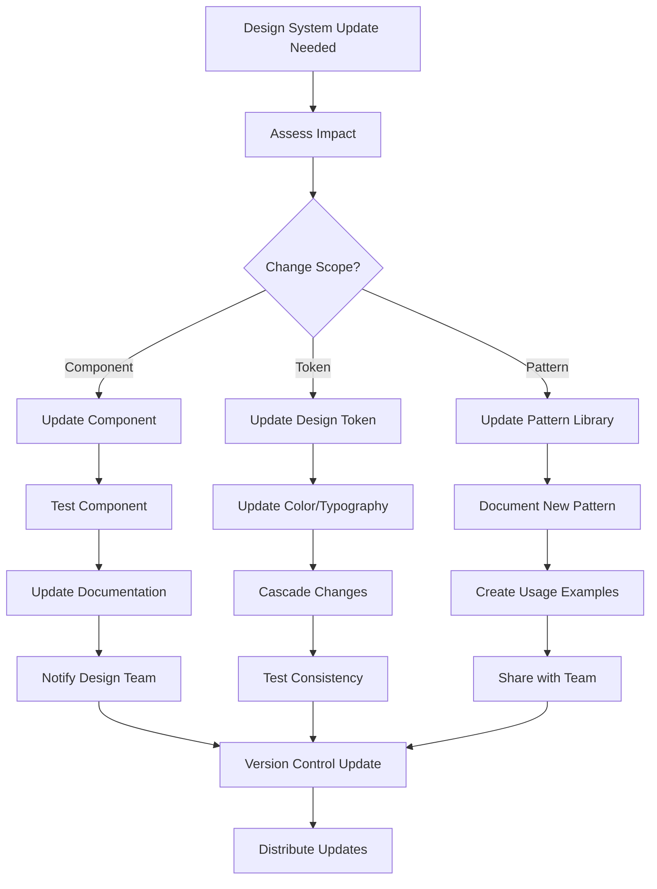

## 🔄 Cross-Persona Collaboration Flows

### Flow 1: Task Handoff (Designer → Developer)
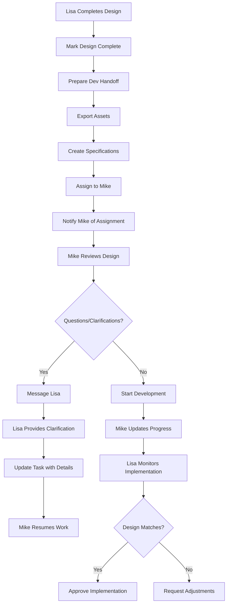

### Flow 2: Escalation (Team Lead → Executive)
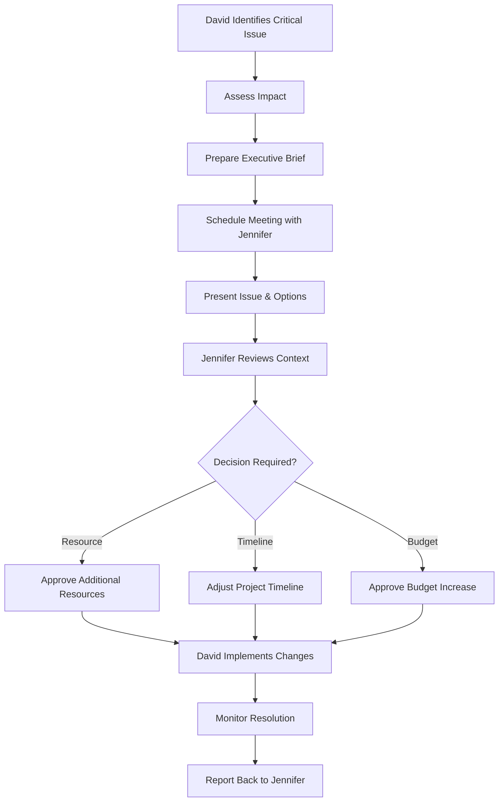

### Flow 3: Project Coordination (PM → All Teams)
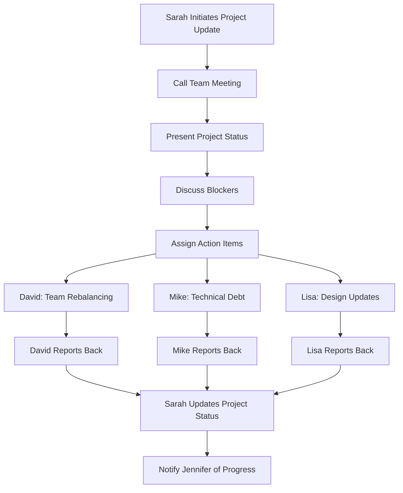

## 🎯 Key Flow Characteristics

### Efficiency Optimizations
- **Minimal Clicks**: Core actions accessible within 3 clicks
- **Context Preservation**: Previous states maintained during navigation
- **Smart Defaults**: Intelligent pre-filling based on user behavior
- **Bulk Operations**: Multi-select capabilities for common tasks

### Error Prevention
- **Confirmation Dialogs**: For destructive actions
- **Dependency Warnings**: Before breaking task relationships
- **Capacity Alerts**: When overloading team members
- **Validation Messages**: Real-time form validation

### Mobile Adaptations
- **Swipe Gestures**: For kanban column navigation
- **Touch-Friendly**: Larger tap targets on mobile
- **Offline Capability**: Core functions work without connection
- **Progressive Enhancement**: Features degrade gracefully

## 🚀 Implementation Notes

### Magic UI Integration Points
```yaml
Flow Animations:
  - Page Transitions: Smooth slides between views
  - State Changes: Animated task card movements
  - Feedback: Micro-interactions for user actions
  - Loading: Skeleton screens during data fetch

Interactive Elements:
  - Hover Effects: Card previews and tooltips
  - Drag & Drop: Task reassignment and reordering
  - Progressive Disclosure: Expandable sections
  - Real-time Updates: Live collaboration indicators
```

### Performance Considerations
- **Lazy Loading**: Content loaded as needed
- **Virtualization**: Large lists rendered efficiently
- **Debounced Actions**: Prevent excessive API calls
- **Optimistic Updates**: Immediate UI feedback

---

**Next Phase**: High-fidelity prototypes incorporating these user flows with Magic UI components for interactive testing and validation.

**Flow Validation**: Each flow designed for <30 seconds completion time for primary tasks, with clear escape routes and error recovery paths. 